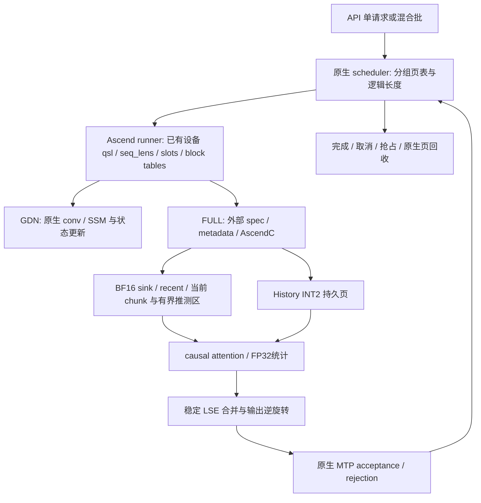

# OSCAR Ascend：端到端设计与可证边界

本设计以 PR `57286d5d`、vLLM `0fc695fc`、Ascend `19e43698` 为准，历史故障来自工作区档案 G1–G34、#1–#122。当前是本地开发；设计证明、CPU 测试、AscendC 编译、设备完成、图捕获、图回放、性能分别记账。待验证项不能勾选。

## 1. 全局生命周期

在线数据位于所属 TP rank 的 NPU，算子使用当前 NPU stream。Host 只处理配置、形状和已有批量调度元数据；生产不得从设备读 KV 到 Host。图模式需要固定地址与可回放设备元数据。临时 probe 设备同步只用于验证，不能混入计时生产路径。

## 2. 联动矩阵与接缝

| 关注点 | 原生机制与证据 | 外部接入 | 不变量 |
|---|---|---|---|
| 后端选择 | platform.py:815 | 延迟 classmethod 包装 | GDN 不改；FULL 启用失败则中止 |
| spec/分组 | platform.py:1292; kv_cache_utils.py:1158 | 自定义 FULL spec | 各 group 独立页表，共享物理池 |
| 分配/视图 | model_runner_v1.py:4080,4351,4696 | 包装 allocation/reshape | GDN SoA 地址逐字节保留 |
| blocks/slots | worker/block_table.py:52–88 | virtual128→physical B | 页号不重定义，逆映射准确 |
| MTP | spec_decode/llm_base_proposer.py:215 | 复用 target/draft 生命周期 | draft eager 不改变 target 图 |
| 图/异步 | platform.py:630; runner:3093 | 固定 buffer/device metadata | 无 D2H，dummy slots不写持久页 |
| TP/W8A8 | runner 原生模型路径 | FULL attention 之外不替换 | 4 rank / ascend 权重量化保留 |
| prefix/抢占 | 原生 block 分配/共享 | 精确窗口所有权协议待完成 | 无 owner 丢失后 INT2 替代 |
| 校准 | PR rotation.py; 论文 compute_kv_rotation.py | 模型/PR指纹 artifact | Hadamard 标明 data-free |

接缝路径均相对 `references/vllm-ascend/vllm_ascend/`，vLLM 管理文件相对 `references/vllm/vllm/v1/`。详尽证据见 `native_integration.md`。

## 3. 时间线与窗口

单 token：projection → 请求窗口判定 → 留在 BF16 recent → 仅在越过最终已提交窗口边界时旋转/clip/quant/pack → INT2 页 → attention tile 消费 → 页回收。当前 chunk 的原始 KV 可直接被 causal attention 消费，不必压缩后立即重建。

MTP：draft 三步 → target verify 最多四 query → 原生 acceptance 得到有效长度 → 只提交被接受部分 → rejected tail 下轮覆盖。计算中的可见长度、持久提交长度和 staging 已物化长度是三个量，不能把 seq_len 当已提交长度（#37–49）。verify 必须复用历史 tile；固定窗口不能因为拒绝而丢失 BF16 行。

抢占/恢复：原生页与 GDN 状态按原生协议处理；FULL 窗口身份必须随着页共享/写时复制/释放同步。具体 owner-generation 协议尚未完成，不发布虚假的生产 provider。

窗口公式：`s=min(S,L); r=min(R,L-s); h=L-s-r`。Sink `[0,s)`、History `[s,L-r)`、Recent `[L-r,L)`。PR sink 向下对齐整页以及 staging 驱逐后的 INT2 替代不能作为本任务固定窗口的实现，列为需独立验证的工程差异。

## 4. 显存账

每 head/token：`K=ceil(Dk/4)+4`，`V=ceil(Dv/4)+4`，其中每侧4 B是 FP16 scale/zero。Dk=Dv=256 时136 B，BF16是1024 B。顺序为 K payload/meta 后 V payload/meta；无无依据160 B常量。

GDN 原生为 SoA：conv 位于 `b*C`，SSM 位于 `nb*C+b*M`。因此 FULL packed 页只能使用对应 SSM 区，不可按 `b*P` AoS 写。`U=lcm(B_mamba,128)`，`B_full=floor(M/(Hkv*slotbytes*U))*U`。虚拟页 v 的物理页 `v//(B_full/128)`，页内 token `(v%(B_full/128))*128+t`。C/M 从真实状态形状与dtype取得，P另从原生 `MambaSpec.page_size_bytes` 读取，不能用P减conv反推SSM。

原生 `patch/platform/patch_mamba_config.py:94–119` 以单K页对齐SSM，随后计算双K/V页并增加conv padding，因此典型 `P=C+2*M`。例如目标BF16 SSM若为393216 B、conv为15360 B，P仍为801792 B；**801792不是FP32 SSM的证据**。单本地KV head、D256时nativeB=768；prefix启用且mamba align时 `:143–146` 令 `B_mamba=nativeB`，本布局得到 `B_full=2304`、scheduler LCM=2304。若原生采用 `B_mamba=max_model_len`，当前容量公式会显式拒绝，相关模式仍未实现，不能改变GDN语义绕过。

池 bytes=`num_tensors*nb*P`，包括原生尾padding `nb*(P-C-M)`；packed只使用实际SSM区，padding未被声明回收。单请求 FULL token容量随 B_full 改变，但实际 capacity 还受3个 GDN group 的状态块、LCM、MTP、prefix占用制约。额外预算包括 BF16 窗口、owner、旋转常量、固定 split workspace、图缓冲。**不能仅根据136/1024宣布全模型显存收益。**

## 5. 性能账与长度标尺

| 相位 | 计算/流量 | D.4历史量级 | 本轮结论 |
|---|---|---|---|
| prepare | 批量设备元数据 O(batch+new tokens) | 725ms host 异常 | 禁止逐请求 Python 热循环 |
| store | O(new/migrated tokens·D²) rotation，O(tokens·D) quant | 16K约215ms | clip+quant+pack+scatter需融合 |
| history attention | Θ(LD/4) compressed读取，O(qLD)算术 | full dequant 6.5s、FIA18.7ms | 不准全历史BF16物化；CV未验收 |
| windows | O((S+R+q)D) | FIA子相位 | 只需精确有界BF16 |
| merge | O(q·Hq·splits·D) | materialize约0.5ms | FP32稳定LSE合并 |

| L | History上界 S64/R256 | INT2 bytes/head/layer/rank | native128页表列下界 |
|---:|---:|---:|---:|
|16384|16064|2184704|128|
|32768|32448|4412928|256|
|50000|49680|6756480|391|
|100000|99680|13556480|782|
|262144|261824|35608064|2048|

所有长度用同一公式和 tile 循环；实际表列数取原生 buffer.shape，不用上表替代MTP额外容量（#36）。workspace只依赖固定tile、query容量和split上界，不分配 `[L,D]` BF16历史。

### 硬约束冲突登记

H18的“历史读取亚线性”与任意数据的精确 dense attention 不可同时成立：若算法不读取某个历史V，改变该V即可改变正确输出。至少Ω(L)读取不可消除。可以满足的是全历史BF16物化量为0，MTP跨query共享tile。这个冲突仍未被用户修订，不勾选H18。

A2 Cube/Vector片上交接也需实际CANN编译/运行证据；不能把经GM中转的 `VECIN` 当作零HBM解包。参见 `ascendc_design.md`。本地缺CANN/NPU，C04仍未完成。

## 6. 每个节点固定六问

| 节点 | 原生机制 | OSCAR语义 | 接入 | 边界不变量 | 失败 | 验证 |
|---|---|---|---|---|---|---|
| quant | PR store:41–77 | FP32输入、FP16 meta先舍入 | AscendC vector | 单head组、LSB-first尾块 | 非有限/零scale显式错误 | 独立oracle位级对拍 |
| rotation | PR attn:219–243 | x@R和abs quantile clip | AscendC融合待实现 | 正交、来源可追溯 | artifact缺失或不匹配中止 | orthogonality+模型质量 |
| layout | runner:4696 | 压缩仅FULL | 外部spec/view | GDN地址隔离 | 无法容纳则显式错误 | byte区间与真实allocator |
| metadata | runner:3034 | 批量长度和slot | 独立builder | native容量与device不变 | 容量/形状契约错误 | capture/replay真机 |
| lifecycle | MTP/native blocks | BF16窗口不可遗失 | owner协议待实现 | prefix/COW/reject一致 | provider未就绪中止 | 状态机及真实调度 |
| attention | PR decode+LSE merge | 等价Q旋转/输出逆旋转 | CV kernel待完成 | causal/GQA/全长度 | 无production替代路径 | device→graph→TP4 |
| deployment | 原生serve参数 | 压缩路由确实命中 | 外部包+当前stream | 原生源码不变 | phase非零+资源清理 | 故障注入+硬件证据 |

## 7. 历史故障回归

| 档案 | 根因类 | 结构规避 | 验证 |
|---|---|---|---|
|G1–G13/#3/#21/#79–85/#87–93|CANN编译/tiling/API/UB|单一ABI头、真实SOC、签名清build、原生先例|目标编译+加载+数值 |
|G14–G24/#23–25/#29–30/#84/#96–97|证书/校准/线程池|可信CA、采样一致性、fork前建池、显式artifact来源|本地环境记录+NPU校准 |
|G25–G34/#4–22/#53–69/#111|meta/数值/输出/LSE|独立PR oracle、冻结阈值、输出全部写入|CPU语义+NPU对拍 |
|#26–52/#74–78|导入/容量/事务|轻量hook、实际buffer容量、owner不伪造|fresh process+调度状态机 |
|#70–73|全历史恢复/慢store|禁止独立全历史dequant生产路径|分相位device计时 |
|#94–95/#101/#116–117/#120|shell吞错误/日志/cwd/挂起|Python相位管理、绝对cwd、独立日志、进程组超时|故障注入 |
|#98–110/#112–115/#118–122|构建产物/符号/运行加载口径|明确direct-launch单路径、产物manifest、真实call probe|加载≠设备完成 |

## 8. 自审

- [x] 全局数据旅程、预算与原生接缝已建立。
- [x] PR工程差异、数学冲突和历史失败未隐藏。
- [ ] owner/prefix/MTP完整生产协议及其等价证明。
- [ ] 真正fused CV、融合旋转裁剪和设备元数据实现。
- [ ] CANN编译、NPU数值、图回放、性能和实际容量通过。

设计尚未达到四条性质全绿；任何拒绝启动的门禁都不能计作实现完成。
