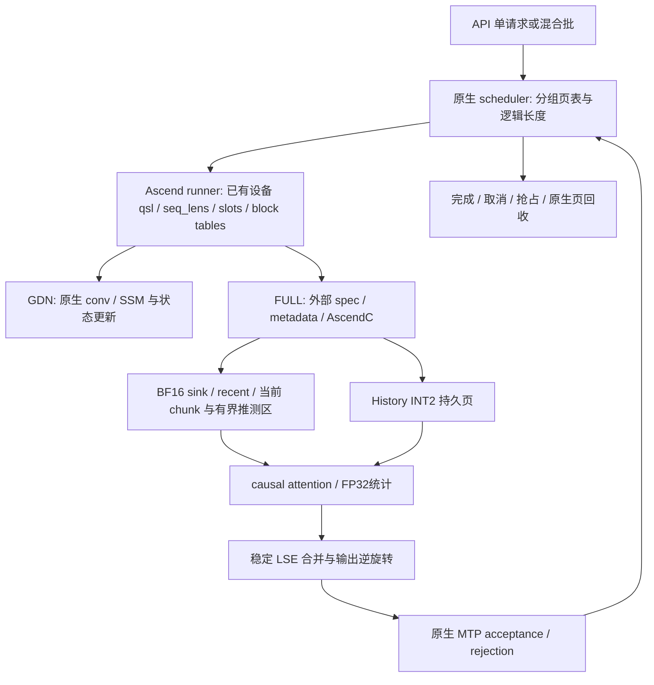

# OSCAR Ascend：端到端设计与可证边界

本设计以 PR `57286d5d`、vLLM `0fc695fc`、Ascend `19e43698` 为准，历史故障来自工作区档案 G1–G34、#1–#128。本轮已完成源码调用链、VM CANN编译和官方CPU-debug；设计证明、CPU调试、设备完成、图捕获、图回放、性能分别记账。待验证项不能勾选。

## 1. 全局生命周期

在线数据位于所属 TP rank 的 NPU，算子使用当前 NPU stream。Host 只处理配置、形状和已有批量调度元数据；生产不得从设备读 KV 到 Host。图模式需要固定地址与可回放设备元数据。临时 probe 设备同步只用于验证，不能混入计时生产路径。

## 2. 联动矩阵与接缝

| 关注点 | 原生机制与证据 | 外部接入 | 不变量 |
|---|---|---|---|
| 后端选择 | platform.py:815 | 延迟 classmethod 包装 | GDN 不改；FULL 启用失败则中止 |
| spec/分组 | platform.py:1292; kv_cache_utils.py:1158 | 自定义 FULL spec | 各 group 独立页表，共享物理池 |
| 分配/视图 | model_runner_v1.py:4080,4351,4696 | 包装 allocation/reshape | GDN SoA 地址逐字节保留 |
| blocks/slots | worker/block_table.py:52–88 | virtual128→physical B | 页号不重定义，逆映射准确 |
| MTP | spec_decode/llm_base_proposer.py:215 | 复用 target/draft 生命周期 | draft eager 不改变 target 图 |
| 图/异步 | platform.py:630; runner:3093 | 固定 buffer/device metadata | 无 D2H，dummy slots不写持久页 |
| TP/W8A8 | runner 原生模型路径 | FULL attention 之外不替换 | 4 rank / ascend 权重量化保留 |
| prefix/抢占 | 原生 block 分配/共享 | 原生padding中的页边界精确snapshot | 无 owner 丢失后 INT2 替代 |
| 校准 | PR rotation.py; 论文 compute_kv_rotation.py | 模型/PR指纹 artifact | Hadamard 标明 data-free |

接缝路径均相对 `references/vllm-ascend/vllm_ascend/`，vLLM 管理文件相对 `references/vllm/vllm/v1/`。详尽证据见 `native_integration.md`。

## 3. 时间线与窗口

单 token：projection → 当前chunk直接参与精确causal attention → fused rotate/clip/quant/pack仅处理新K/V并写INT2页 → 在同一launch保留精确sink或页内recent snapshot/tag → 后续attention按全局窗口选INT2/BF16 → 原生页回收。与PR一致，新token先保存INT2表示；精确窗口只保留一份canonical BF16，后续滑入History无需重复量化，也无需恢复已压缩旧chunk。

MTP：draft 三步 → target verify 最多四 query → 原生 acceptance 得到有效长度 → 可见范围排除被拒绝部分 → rejected物理尾部下轮覆盖（无独立shadow历史）。计算中的可见长度、持久提交长度和 staging 已物化长度是三个量，不能把 seq_len 当已提交长度（#37–49）。verify 必须复用历史 tile；固定窗口不能因为拒绝而丢失 BF16 行。

抢占/恢复：原生页与 GDN 状态按原生协议处理；FULL 窗口身份必须随着页共享/写时复制/释放同步。本实现用原生物理页自身持有唯一snapshot，无独立request-owner arena。完整不可变前缀页保留尾R+spec行供任意prefix边界重用；只在逻辑首部写Sink，不把每页局部边界当全局窗口。后续MTP draft的seq_lens可能仍含拒绝token，device prepare通过真实slot与无序virtual块表恢复逻辑位置（原生方法已执行复现），不使用mrope坐标。详见 runtime_implementation.md。

窗口公式：`s=min(S,L); r=min(R,L-s); h=L-s-r`。Sink `[0,s)`、History `[s,L-r)`、Recent `[L-r,L)`。PR sink 向下对齐整页以及 staging 驱逐后的 INT2 替代不能作为本任务固定窗口的实现，列为需独立验证的工程差异。

## 4. 显存账

每 head/token：`K=ceil(Dk/4)+4`，`V=ceil(Dv/4)+4`，其中每侧4 B是 FP16 scale/zero。Dk=Dv=256 时136 B，BF16是1024 B。顺序为 K payload/meta 后 V payload/meta；无无依据160 B常量。

GDN 原生为 SoA：conv 位于 `b*C`，SSM 位于 `nb*C+b*M`。因此 FULL packed 页只能使用对应 SSM 区，不可按 `b*P` AoS 写。缓存模式为align/all时 `U=lcm(B_mamba,128)`；原生none模式不共享前缀状态，`U=128`。两种模式均按 `B_full=floor(M/(Hkv*slotbytes*U))*U` 计算。虚拟页 v 的物理页 `v//(B_full/128)`，页内 token `(v%(B_full/128))*128+t`。C/M 从真实状态形状与dtype取得，P另从原生 `MambaSpec.page_size_bytes` 读取，不能用P减conv反推SSM。

原生 `patch/platform/patch_mamba_config.py:94–119` 以单K页对齐SSM，随后计算双K/V页并增加conv padding，因此典型 `P=C+2*M`。历史/无spec形状示例 M=393216、C=15360 时P=801792；给定linear heads16/48、D128、TP4、convK4与MTP3，实际原生函数推导 C=30720、P=817152（真实目标config仍须现场核实）；**801792不是FP32 SSM的证据**。单本地KV head、D256时nativeB=768；prefix启用且mamba align时 `:143–146` 令 `B_mamba=nativeB`，本布局得到 `B_full=2304`、scheduler LCM=2304。本次真机prefix关闭、mode=none时，原生保留 `B_mamba=max_model_len=262144`；它表示请求状态跨度，不是FULL物理页对齐。外部FULL spec保留此原生字段和模式，以128为页内对齐，得到 `B_full=2816`、22个虚拟128块、payload=382976B。原生分组仍计算scheduler/hash LCM=2883584（prefix关闭，无前缀哈希消费），原生GDN manager保持每请求1个运行状态+3个MTP状态。没有修改GDN对象、启动参数或原生调度器。Snapshot仍为333336B，位于原生393216B尾padding中。原生配置/分组/manager/释放/GDN reshape/input-batch及两种块长下MTP跨页方法已有可执行回归，真机整机初始化结果待回传。

#128 补齐原生 `AttentionGroup.create_metadata_builders` 接缝：MTP会调用 `copy_with_new_block_size(128)` 为builder创建虚拟块视图。`OscarFullAttentionSpec` 通过显式 `metadata_block_view` 标记允许这个副本；`storage_block_size`、`layout`、真实payload与page字节数始终保留物理页值。原始group spec保持2304/2816，builder副本block_size为128；复制回物理块时移除标记。普通dataclass resize、未知块长、混合物理/虚拟spec merge仍报错，不改变池大小、GDN状态或数值路径。真实原生proposer初始化与AttentionGroup（含多个builder）回归覆盖none/align及不拆分分支；MTP slot更新回归采用实际初始化后的128块长。

池 bytes=`num_tensors*nb*P`，包括原生尾padding `nb*(P-C-M)`；packed只使用实际SSM区，padding按物理页放精确snapshot（每页不超过原生已计费空间）。单请求 FULL token容量随 B_full 改变，但实际 capacity 还受3个 GDN group 的状态块、LCM、MTP、prefix占用制约。额外独立预算包括旋转常量、固定split workspace和当前chunk scratch；这些在model构造期预分配，计入原生profile，不能在KV预算确定后才偷分配。Snapshot BF16/tag已在P内，不重复计费。**不能仅根据136/1024宣布全模型显存收益。**

## 5. 性能账与长度标尺

| 相位 | 计算/流量 | D.4历史量级 | 本轮结论 |
|---|---|---|---|
| prepare | 批量设备元数据 O(batch+new tokens) | 725ms host 异常 | 禁止逐请求 Python 热循环 |
| store | O(new/migrated tokens·D²) rotation，O(tokens·D) quant | 16K约215ms | rotate+clip+quant+pack+scatter已有融合实现 |
| history attention | Θ(LD/4) compressed读取，O(qLD)算术 | full dequant 6.5s、FIA18.7ms | 不准全历史BF16物化；CV未验收 |
| windows | O((S+R+q)D) | FIA子相位 | 只需精确有界BF16 |
| merge | O(q·Hq·splits·D) | materialize约0.5ms | FP32稳定LSE合并 |

| L | History上界 S64/R256 | INT2 bytes/head/layer/rank | native128页表列下界 |
|---:|---:|---:|---:|
|16384|16064|2184704|128|
|32768|32448|4412928|256|
|50000|49680|6756480|391|
|100000|99680|13556480|782|
|262144|261824|35608064|2048|

所有长度用同一公式和 tile 循环；实际表列数取原生 buffer.shape，不用上表替代MTP额外容量（#36）。workspace只依赖固定tile、query容量和split上界，不分配 `[L,D]` BF16历史。

### 硬约束冲突登记

H18的“历史读取亚线性”与任意数据的精确 dense attention 不可同时成立：若算法不读取某个历史V，改变该V即可改变正确输出。至少Ω(L)读取不可消除。可以满足的是全历史BF16物化量为0，MTP跨query共享tile。这个冲突仍未被用户修订，不勾选H18。

A2 Cube/Vector片上交接也需实际CANN编译/运行证据；不能把经GM中转的 `VECIN` 当作零HBM解包。参见 `ascendc_design.md`。本机Lima VM中CANN9.1、910B4编译及官方CPU-debug已通过。实现使用每Cube固定GM通信，容量与L无关，但总通信流量线性；不将其冒充纯片上零HBM。C04真实NPU执行/性能仍未签。

## 6. 每个节点固定六问

| 节点 | 原生机制 | OSCAR语义 | 接入 | 边界不变量 | 失败 | 验证 |
|---|---|---|---|---|---|---|
| quant | PR store:41–77 | FP32输入、FP16 meta先舍入 | AscendC vector | 单head组、LSB-first尾块 | 非有限/零scale显式错误 | 独立oracle位级对拍 |
| rotation | PR attn:219–243 | x@R和abs quantile clip | AscendC融合算子 | 正交、来源可追溯 | artifact缺失或不匹配中止 | orthogonality+模型质量 |
| layout | runner:4696 | 压缩仅FULL | 外部spec/view | GDN地址隔离 | 无法容纳则显式错误 | byte区间与真实allocator |
| metadata | runner:3034 | 批量长度和slot | 独立builder | native容量与device不变 | 容量/形状契约错误 | capture/replay真机 |
| lifecycle | MTP/native blocks | BF16窗口不可遗失 | 原生页+canonical snapshot | prefix/COW/reject一致 | provider未就绪中止 | 状态机及真实调度 |
| attention | PR decode+LSE merge | 等价Q旋转/输出逆旋转 | 真实Cube/Vector kernel | causal/GQA/全长度 | 无production替代路径 | device→graph→TP4 |
| deployment | 原生serve参数 | 压缩路由确实命中 | 外部包+当前stream | 原生源码不变 | phase非零+资源清理 | 故障注入+硬件证据 |

## 7. 历史故障回归

| 档案 | 根因类 | 结构规避 | 验证 |
|---|---|---|---|
|G1–G13/#3/#21/#79–85/#87–93|CANN编译/tiling/API/UB|单一ABI头、真实SOC、签名清build、原生先例|目标编译+加载+数值 |
|G14–G24/#23–25/#29–30/#84/#96–97|证书/校准/线程池|可信CA、采样一致性、fork前建池、显式artifact来源|本地环境记录+NPU校准 |
|G25–G34/#4–22/#53–69/#111|meta/数值/输出/LSE|独立PR oracle、冻结阈值、输出全部写入|CPU语义+NPU对拍 |
|#26–52/#74–78|导入/容量/事务|轻量hook、实际buffer容量、owner不伪造|fresh process+调度状态机 |
|#70–73|全历史恢复/慢store|禁止独立全历史dequant生产路径|分相位device计时 |
|#94–95/#101/#116–117/#120/#125|shell吞错误/日志/cwd/挂起|Python相位管理、绝对cwd、独立日志、实时终端输出、进程组超时；服务子进程输出一并转发|故障注入确认进程退出前能看到错误，并保留原退出码 |
|#98–110/#112–115/#118–122|构建产物/符号/运行加载口径|明确direct-launch单路径、产物manifest、真实call probe|加载≠设备完成 |
|#34/#36/#128|MTP元数据复制block_size128被物理页2816校验拒绝|显式metadata副本保留physical layout/storage_block_size，原始group不变|真实原生MTP初始化/AttentionGroup builder与复制/非法大小回归；目标重跑待确认|
|#34/#36/#127|prefix关闭时把GDN请求跨度262144当FULL页对齐，容量为0|按原生none/align模式计算FULL页，保留GDN原对象与原生LCM、MTP状态数|真实native配置/分组/manager增长释放/reshape/input-batch/MTP跨页回归；目标复跑待回传|
|#74–76/#123|部署设备为null，安装前配置阻断|按本次附录F固定0–3卡和ascend910b4；移除默认环境/源码/readiness审计，保留全部真实探针|默认配置及部署相位本地回归；目标复跑待回传 |
|#124|README混淆真机与开发机命令，缺.venv/limactl|真机首屏一条命令使用现有Python；本地CPU与Mac/Lima命令单列开发说明|文档与默认部署命令核对；目标复跑待回传 |
|G18/#98/#107/#125|扩展的签名kernel依赖库存在但动态加载路径不含实际目录；CANN禁用RPATH|仅在本工程恢复RPATH并包含相邻lib目录；按manifest绝对路径加载已校验kernel，再导入扩展；不修改系统CANN或原生源码|VM旧ELF已证实NEEDED存在而RPATH/RUNPATH缺失；修订链接及Linux加载回归通过，node93后续75项原语NPU执行通过确认已越过该故障 |
|G26/G28/G30/#13/#126|CV有效query之后进入padding时，Vector清零复用缓冲未等待上一行MTE3搬出，造成末个有效head的Q被覆盖|padding的Duplicate之前建立MTE3→V依赖；仅约束固定query tile已有缓冲，不扩大历史恢复/存储，不加Host逐head或CPU替代路径|源码同步缺口与head5置零数值复现匹配目标最大误差/位置；保留0.005冻结容差，修订后的目标CV/图/性能待复跑 |

## 8. 自审

- [x] 全局数据旅程、预算与原生接缝已建立。
- [x] PR工程差异、数学冲突和历史失败未隐藏。
- [x] 原生页/snapshot/MTP可见性源码及原生方法、CPU-debug回归已完成；真机生命周期另列。
- [x] 真正fused CV、融合旋转裁剪、设备metadata和guard已实现并经CANN编译。
- [x] CANN编译和官方CPU-debug通过。
- [ ] 真实NPU数值、图回放、性能和实际容量通过。

设计尚未达到四条性质全绿；任何拒绝启动的门禁都不能计作实现完成。

## 9. 已落地内核的D.4四问与实现差异

| 内核/相位 | 前次故障量级 | 本实现结构 | 量级和证据边界 |
|---|---|---|---|
| prepare | host约725ms | 一次设备metadata launch；后续draft由BT/slot定位，CPU不读长度值 | O(new_tokens log requests + metadata)，后续draft每req查有效表列；CPU-debug，NPU耗时未测 |
| rotate/fused store | 16K写约215ms | Hadamard蝶形或FP32 dense tile；精确sort percentile；只写新token和canonical snapshot | O(NHDlogD)或O(NHD²)，固定UB<64KiB；26个CPU-debug用例 |
| history/window/current CV | dequant6499.8–6655.1ms vs FIA18.5–18.9ms | 同一kernel流式读码、Vector解包/softmax、Cube QK/PV/输出逆旋转；Mq64容纳GQA6×MTP4 | INT2读取Θ(L)，每Cube固定278528B(D256) GM，显式UB161024B/AIV；无[L,D]恢复；实际NPU耗时未测 |
| merge | materialize约0.5ms | FP32稳定LSE，空split poison不参与，独立Log输出buf | O(N*Hq*splits*D)，CPU-debug S1/3/128 |
| guard | host/串行小op易累积 | 单设备核聚合四状态并Trap，替代eq/all/assert多launch | O(status元素)，无D2H；CPU-debug真错误注入通过 |

每项更完整六问/ABI/同步与预算在 cv_implementation.md、rotation_pipeline.md、runtime_implementation.md；它们与本表共同构成本设计。Hadamard是明确算法选择，dense旋转也已实现，不是运行失败后的替代路线。默认无profiling事件；显式OSCAR_TIMING的host_s不写成device_ms，设备时间由真实NPU trace归因（profiling.md）。

运行调用链为prepare→rotate→CV→merge→新KV store→guard；native源方法实际执行测试还验证了spec merge的AssertionError协议、17/16/16/16分组和共享页manager分配。C、M、P和GDN保留页数均动态读取。若假定三个GDN组保留全历史状态，Bfull由768到2304仅将总块数12L/2304降为10L/2304，理论上限约1.2倍而非3倍；align的实际保留与prefix/LRU另按原生manager核算；本次none配置则保留每个GDN组1+3状态，FULL块长2816，最终收益待实机。

工程差异：本工程使用原生已有ascendc_library/direct-launch，不产出custom OPP vendor。PR窗口驱逐到INT2的退化行为被精确snapshot取代；所有不可用snapshot或非法量化metadata显式报错。常量向量导致FP16 scale下溢为0的PR未定义域仍显式报错，未私改epsilon。全部工程差异与真实未验项保留在checklist中。

### 9.1 静态形状自适应分块

默认arena容量不变，设 `qtile=floor(64/GQA)`、`groups=ceil(n/qtile)*Hkv`，选择 `S=max(1,min(32,ceil(CubeCores/groups),floor(arena_token_capacity/n)))`。只读取已经给定的shape/设备属性；同一捕获n始终得到同S/地址/stride，不读取CPU seq_lens。原partial/LSE/tasks/status平面arena复用为3*S段，保证n*S不超预分配容量。实际20Cube/GQA6时n4→S20，n16384→S1，避免单请求历史只有一个task。新增S2/S20真实CPU-debug已证明互斥历史分区、query复用、empty splits与真实3*S merge的数值一致；没有因此宣称NPU提速。
