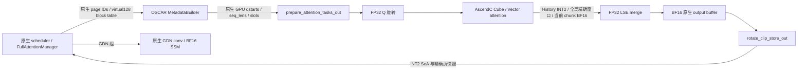

# Runtime 实现、页快照与验收边界

档案引用：#26（窗口必须精确）、#27（安装不等于服务）、#28/#77/#78（延迟导入）、#31–33（不向 VllmConfig 增加字段）、#34/#36（实际图缓冲容量）、#37–49（请求身份、MTP materialized/commit 推断失配）、#69/#111（设备和 dtype）、#86/#97（模型与 draft 旋转）。本文件描述本次源码，不把历史档案的设备日志当本次验收证据。

## 1. 全链调用与原生接缝

原生 `model_runner_v1.py:4080` 定义分配、`:4351` 定义 reshape、`:4681` 保留 GDN SoA 视图、`:4735` 用 backend kernel block size 拆分虚拟页。本实现通过外部 hook 接入三个方法；原生 GDN 的 spec 对象、dtype、shape、页 ID 和 reshape 实现原样保留。OSCAR provider 保存在模块单例中，未扩展 `VllmConfig`。

具体生产入口为 `AscendRuntimeProvider` 和 `OscarAttentionImpl.forward`。构造模型时就按真实 `Hq/Hkv/D` 预分配共享 scratch，并加载全部旋转常量，确保原生 KV 内存 profiling 看见这些分配；不能等 KV 池按 HBM 预算分配完才临时追加 workspace。注册阶段只保存 stdlib lazy factory，第一次原生 backend 请求才加载 torch/NPU/operator。

当前 chunk 直接读取 projection BF16，引用 PR `oscar_attn.py:486–577`。续 chunk 的历史在 tile 内恢复，绝不生成 `[history_length,H,D]` BF16 Tensor。Qwen3NextAttention 的 V 来自 `qkv.split`（原生 `qwen3_next.py:312–337`），可能非连续，因此预分配仅覆盖当前 token budget 的 BF16 scratch，必要时 `copy_` 当前 Q/K/V。这不是历史副本，计入下文 scratch 账。

## 2. 精确页快照不是每页逻辑窗口

原生 `single_type_kv_cache_manager.py:298–338` 只把 `floor(num_tokens / block_size)` 个完整页交给 `cache_full_blocks`。因此任意共享前缀命中边界都是完整 FULL 物理页边界。逻辑 Sink 始终只指请求最初的 `S` 个 token；Recent 始终按 query 的全局逻辑位置定义，不能在每页重新开始计算。

**每个完成页保存自己的末 `R+K` 个 BF16 token，作为该页成为共享前缀最后一页时所需的快照。** 这是原生任意完整页 prefix 命中所需的持久数据，不是“每页都参与注意力的 Sink/Recent”。只有当前请求 block table 指向的全局 Sink/Recent 位置才会读取精确数据。Sink 的 `S` 个位置只在请求逻辑第一页写入；其他物理页虽然保留同样的容量/步长，Sink 区不复制数据也不参与计算。

以下是 `C=15360/M=393216/P=801792` 给定几何的地址实例；生产值从实际 native spec 推导，不从旧项目记忆继承，也不把该实例当作尚未读取的模型 config：

| 区域 | 开始字节 | 单物理页 stride | 用途 |
|---|---:|---:|---|
| conv SoA | 0 | 15,360 | 原生 GDN |
| SSM / INT2 SoA | `nb * 15,360` | 393,216 | GDN 状态或拥有独立页 ID 的 FULL INT2 |
| native padding SoA | `nb * (15,360 + 393,216)` | 393,216 | FULL 精确快照与 tags |

该实例 `P=801,792`，`B_mamba=768`，`B_full=2304`，virtual kernel block=128。FULL token 的 INT2+fp16 metadata 为136字节，不是160字节。INT2占 `2304*136=313344` 字节/页，未越过 SSM 区。精确快照占：

`(64+256+3) * (256+256) * 2 + (64+256+3)*8 = 333336` 字节/页。

快照全部位于原生已计费 padding；其范围与**所有页**的 conv/SSM SoA 都不交叉。不能用 `physical_page*P` 寻址，因为原生不是 AoS。精确视图和 INT2 视图与原生 raw allocation 共享 storage，不存在第二个 BF16 KV pool。固定 HBM 下的可用页/上下文容量仍须同时扣 GDN blocks、null block、页取整、MTP 保留和 workspace；不能用 FULL 的理论压缩比代表全模型显存收益。

**MTP 的 conv 宽度必须实时计入。** 原生 `qwen3_5.py:694–707` 把 speculative token 数传给状态形状计算器，`mamba_utils.py:224–226` 使用 `conv_kernel_size-1+num_spec`。例如 TP4、linear K/V heads=16/48、K/V dim=128、conv kernel=4 时，无spec是C15360；MTP3变成C30720，原生P817152，M393216和padding393216不变，OSCAR B仍为2304。真实源函数的CPU契约测试验证了这一差别；目标模型实际config尚未读取时不能宣称其C固定为15360。运行期 `cache_layout` 记录真实P/B。

## 3. 生命周期与 MTP

| 事件 | 行为 | 正确性来源 |
|---|---|---|
| 首次 prefill | 当前 chunk BF16 attention；之后写 INT2 和有界精确快照 | PR 首 chunk 原始 K/V |
| 续 chunk | 先读取旧窗口；当前 chunk 直接读 projection；完成 attention 后才更新 ring | 避免长 chunk 提前覆写旧 Recent |
| decode / verify | target与first draft由GPU seq_lens/qstarts决定context；后续draft由slot在virtual block table内的位置决定context | 不推断 host pending/materialized 长度 |
| 全接受/部分接受/全拒绝 | 下一轮原生长度排除 rejected suffix；相同 slots 可被新 token 覆盖 | `R+3` ring 保存最近 R 加最多3个未接受写入 |
| prefix 命中 | 从已共享的完整页直接读取 Sink 和边界尾快照 | 无 staging owner 查找、无 INT2 代替精确窗口 |
| batch 重排 | 只改变原生块表行；快照跟随物理页不随行号 | 不需要 host 身份转移 |
| 完成/取消/抢占 | 交给原生 allocator 释放页；新请求重算后发布新 slots | 只读取新请求实际 context；不消费未写入后缀 |
| graph dummy | 负 slot 在设备侧标记无效；不写 KV，输出0和 LSE=-inf | 捕获和回放运行同一条 kernel 路径 |

为什么保留 `R+3`：一次 target verify 最多写 `1+3` 个 token，下一轮至少提交其中已知的第一个，因此 materialized high-water 相对下一轮 context 最多超前3。所有仍属于已提交 Recent 的 R 个位置都落在 `R+3` 个 ring 槽内。CPU 生命周期证明覆盖窗口边界、页边界、全部接受长度和较长 prefix；真实 NPU/模型 MTP 接受行为仍须目标验收。

原生 MTP `llm_base_proposer.py:1662` 使用 int32 slots，而主 runner 使用 int64。runtime 用一个固定 int64 scratch 对 draft slots 做 device cast，不读回 CPU。`:1667–1676` 的 draft seq_lens/qstarts 仍然作为权威设备元数据传入；不读取原生已弃用 CPU 属性。

原生 padded MTP 的长度另有关键约定：`:1953`保留rejected rows，`:1608`后续draft只将seq_lens加1，而`:1654`由接受位置重新计算slot。因此后续draft的原生seq_lens是上界，不能据此断言真实query位置。真实native更新方法的CPU执行复现了 `seq_lens-1 - actual_query_position = 3-accepted_proposals`。本实现仅对 `draft_index>0` 启用device slot解析：在本request的无序virtual128 block table有效上界内查唯一 `slot//128`，得到 `position=column*128+slot%128`；该位置即单query的context。缺失/重复映射或非单query返回设备metadata错误，status guard终止，不借用mRoPE坐标、不修改GDN或native拒绝计数。主模型verify与first draft保持当前chunk语义。这个修复依据CPU源码复现，不伪写为新真机档案。

## 3.1 原生 grouping、manager 与固定 HBM 容量

实际执行原生 `get_kv_cache_groups`，17个FULL+48个GDN产生 `[17 FULL,16 GDN,16 GDN,16 GDN]` 四组和17个共享张量。一个源接口错误已修正：`is_kv_cache_spec_uniform`通过试调用`merge()`并捕获`AssertionError`判断是否uniform；custom spec的mixed merge必须遵循该协议，抛ValueError会在hybrid分组前中止。

原生 `resolve_kv_cache_block_sizes` 实际返回 scheduler LCM=2304、hash GCD=768；`BlockHashListWithBlockSize`按3个768-token hash组成一个2304-token hash。真实Ascend coordinator初始化保留native FullAttentionManager和AscendMambaManager，公共pool中的非null物理ID互不重叠。对一次4608 token输入加3 lookahead，实际native方法分配FULL 3个非null块，align模式每个GDN组首次分配1个当前状态+3个spec状态，历史索引用null占位，不应把这些null ID计成物理页。

设可给KV池的预算为 `H - E`（E已包括模型、activation、旋转、workspace和图等独立开销），原生每pool block的真实字节为 `17*P`，因此：

`nb = floor((H-E)/(17*P))`。

对于同时存活的请求i，实际可用容量须满足：

`1 + sum_i ceil((L_i + lookahead_i)/2304) + sum_(GDN组g,请求i) live_state_blocks(g,i) + pinned_prefix_blocks <= nb`。

其中1是null block；prefix块只统计不已经包含在请求live集合中的不可回收块，不能双计。`live_state_blocks`必须按原生mamba模式、复用和checkpoint生命周期计数：align首次为 `1+K`，跨步保留上界可按原生 `MambaSpec.max_memory_usage_bytes` 的 `2+K`，并另计不能回收的prefix checkpoint。当前Qwen3.5和MTP源码拒绝mamba `all`模式；不能把其他模型全历史SSM假设当本目标实际行为。

作为另一种纯理论情形，若三个GDN组确实保留全部历史SSM，忽略边界和E变化时，native pool消耗约 `4L/768 = 12L/2304`，OSCAR约 `L/2304+3L/768 = 10L/2304`，仅为1.2倍容量；绝不是全模型3倍。当前align模式的实际容量比还受prefix占用、GDN保留、MTP和新增E影响，未跑NPU不得签署实测容量收益。

## 4. 按 query 的逻辑分段与 PR 差异

对当前 query 位置 `p`、之前已存在 context `C`：

* Sink：`[0,min(S,C))`；
* cached History：`[min(S,C),min(C,max(S,p+1-R)))`；
* cached Recent：紧接 History 到 `C`；
* 当前 chunk：`[C,p+1)`，保持 BF16，并受 causal mask 约束。

四段连续、不重叠、无缺口。History 使用 `q@Rk`，CV 中 FP32 解包/softmax，在写 partial 前乘 `Rv.T`，随后各段以稳定 LSE 合并。多个 query 共享 history tile，但逐 query 使用自己的 causal/窗口 mask。

PR 工程中的 staging eviction 后 INT2 替代、CPU 循环组装、完整历史 dequant、inverse rotation、拼接已被改变；数值目标为无 eviction 的精确全局窗口。MTP 原生 draft 层使用显式、可观察的 identity rotation（档案 #86）；target 层必须加载与模型 config+weight index 指纹匹配的 artifact。data-free Hadamard artifact 的 objective 不等于已经完成模型质量评估。

## 5. 图与性能账

MetadataBuilder 直接保留 native GPU tensors；捕获时记录 pointer/shape/stride/dtype，后续相同图形状若地址改变立即拒绝。原生 `_dummy_run` 在 capture 分支不保证初始化 slots（`:3548`只在非capture分支fill），因此 capture builder 显式将合成输入 slots 置为-1，避免依赖 warmup 次数或旧缓冲内容；完整各算子仍被捕获，真实回放前由原生 `_prepare_inputs` 在同地址写入真实 slots。元数据 kernel 在回放时重新读取这些设备数据，不把 seq_lens 固化为 host attrs。原生 `acl_graph.py:270` 要求的 `update_graph_params` 接口保留；本实现没有 FIA 的 host task attrs 或 external-event waits，因此不需要更新一个不存在的 FIA task。GDN 图分支完全原生。

设 token capacity 为 `N`、query heads为 `Hq`、KV heads为 `Hkv`、head dim为 `D`，`g.splits`为预分配容量乘数（配置 `attention_splits`，默认1）。task容量为 `3*N*Hkv*g.splits`，每行16个int64；partial arena容量为 `N*Hq*3*g.splits*D` 个FP32，LSE按同一行数计。scratch总量由 `WorkspaceGeometry.total_bytes`逐项计数，包括当前 Q/K/V 连续化缓冲、FP32 Q旋转、partial/LSE、merge输出、全部状态、slot/position及每Cube core工作区。所有层在同一原生执行流顺序复用一个同形 arena，不按17层重复分配。

每次调用的实际source split数只由捕获的query形状决定，避免单请求长decode仅使用一个history Cube：

`query_tile = floor(64 / (Hq/Hkv))`

`groups = ceil(n/query_tile) * Hkv`

`S = max(1, min(32, ceil(measured_cube_cores/groups), floor(N*g.splits/n)))`

例如测得20个Cube、Hq/Hkv=6、N=16384、默认容量乘数1时，n=4使用S=20，n=16384使用S=1。它不读取CPU或设备seq_lens来选择路径，不依赖历史长度；所有长度仍由同一kernel计算，各split读取互不重叠的候选区间，再用既有LSE merge合并。实际吞吐是否提升必须由设备测量证明。

每次从相同平面arena开头取 `n*Hq*3*S*D` 个FP32并view为 `[n,Hq,3*S,D]`；LSE、tasks、status同样取对应前缀。`n*S<=N*g.splits`保证容量不增长，base pointer始终不变，同一捕获n得到相同S、shape和stride。没有为decode另外分配workspace，也没有把默认prefill arena扩大20/32倍。`g.splits`表示明确选择的容量乘数，实际S以此公式和实测核心数约束。

Cube grid 在初始化时读取原生 `triton_utils.py:46–67` 的驱动属性 `num_aicore/num_vectorcore`，校验2个Vector对应1个Cube，按实际AIC数量及ABI上限32选择；不硬编码某一型号为24核。这里调用的是原生硬件属性查询，不是用Triton执行OSCAR算子。显式配置核数也不能超过检测到的硬件数。

| 上下文长度 | FULL物理页上界 | 窗口逻辑量 | 额外 BF16历史恢复 | scratch随历史增长 |
|---:|---:|---:|---:|---:|
|16,384|8|最多320|0|否|
|32,768|15|最多320|0|否|
|50,000|22|最多320|0|否|
|100,000|44|最多320|0|否|
|262,144|114|最多320|0|否|

每页用于 prefix 的持久精确快照不在此“参与当前注意力窗口”量中重复计数；其占用已经包含在原生P预算内。INT2读量与精确 dense attention 的历史长度线性增长，H18字面“读取亚线性”不能成立，必须与“不全量恢复”区分。store对当前输入量化一次，同时保留必要精确窗口/快照；没有每一步重扫、恢复或重新量化全历史。

D.4 对照：取消6.5s全历史dequant和逆旋转phase；prepare为设备批量任务构建；store仅当前token量；最后一个 `status_guard` AscendC kernel检查四组状态，遇错执行设备 Trap，避免每层多个Torch布尔/归约/断言小算子。attention的当前源码性能仍必须用目标机器按相同输入进行逐phase计时。Host不做请求级循环、KV数值处理或tensor读回。不可在没有NPU时声称目标32K性能已优于原生。

## 6. 验收状态

本机测试能验证地址、形状、metadata持久性、padding隔离、MTP窗口保留和Python派发约束。`tests/test_runtime_native.py` 还直接执行只读参考文件中未改写的KV spec/registry/metadata基类和原生GDN reshape方法，检查外部spec转换后原生GDN视图的实际dtype、shape、地址与内容不变；外部依赖以测试夹具提供，因此这是host接缝证据，不是完整vLLM实例。CANN编译/CPUdebug属于另一层证据。目标NPU设备完成、graph capture返回、真实请求graph replay、TP4/MTP/prefix服务、冻结精度及配对性能均独立记在 `docs/checklist.md`；本文件不把任何前一层通过等同于后一层。
